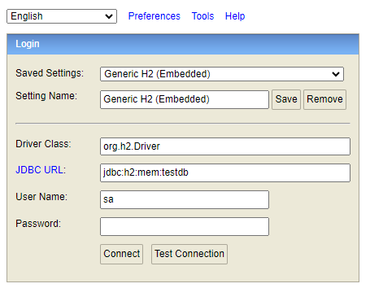
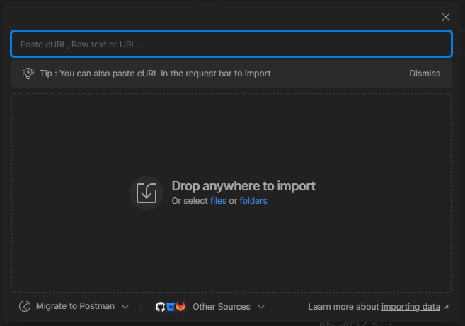
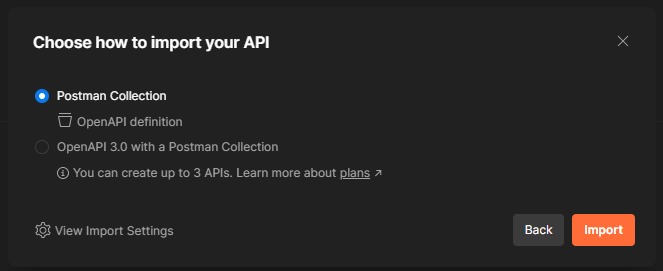

# Spring Data REST Example

[ja](./README_ja.md)

## Dependencies

This project uses the following libraries:

- Spring Boot Starter Data JPA: A starter to make accessing databases and integrating JPA easier.
- Spring Boot Starter Data REST: A starter to facilitate building RESTful APIs using Spring Data REST.
- Lombok: A library to automatically generate and omit boilerplate code in Java.
- H2 Database: A Java DBMS used as an in-memory database.
- Spring Boot Starter Test: A starter for testing Spring Boot applications.
- JUnit Platform Launcher: A library providing the launcher for JUnit5.
- Springdoc OpenAPI Starter Web MVC UI: A library to display OpenAPI specifications in HTML format.

### About Spring Data REST Auto Endpoint Generation

Spring Data REST automatically exposes RESTful endpoints for your Spring Data repositories. This greatly simplifies the development of RESTful services by eliminating the need to manually create controllers for basic CRUD operations. Here’s how it works:

1. **Repository Creation**: Define a repository interface for your entity by extending `CrudRepository`, `JpaRepository`, or any other Spring Data repository interface.
   ```java
   import org.springframework.data.jpa.repository.JpaRepository;
   import org.springframework.data.rest.core.annotation.RepositoryRestResource;

   @RepositoryRestResource
   public interface UserRepository extends JpaRepository<User, Long> {
   }
   ```

2. **Entity Definition**: Ensure you have an entity class that maps to a table in your database.
   ```java
   import javax.persistence.Entity;
   import javax.persistence.GeneratedValue;
   import javax.persistence.GenerationType;
   import javax.persistence.Id;

   @Entity
   public class User {
       @Id
       @GeneratedValue(strategy = GenerationType.IDENTITY)
       private Long id;
       private String name;

       // getters and setters
   }
   ```

3. **Running the Application**: With minimal configuration, Spring Data REST will expose endpoints for the `User` entity, allowing you to interact with the data using HTTP methods. You can use `GET`, `POST`, `PUT`, `DELETE` requests against `http://localhost:8080/users`.

This automation reduces boilerplate code, enabling rapid development of data-driven applications. For instance, accessing `http://localhost:8080/users` will provide a list of users, and posting to the same endpoint will allow you to add new users.

```properties
spring.data.rest.base-path=/api
```

In this example, the base path for all Spring Data REST repositories would be changed to `/api`. So, the `User` entity endpoints would be accessible at `http://localhost:8080/api/users`.

For further customization and more advanced configurations, consult [the official Spring Data REST documentation](https://spring.io/projects/spring-data-rest).

## Entity Overview

The application is structured around two primary entities: `Users` and `Posts`. These entities are central to the data model and directly influence the RESTful API endpoints generated by Spring Data REST.

### Users Entity

The `Users` entity encapsulates user information and establishes a relationship with the `Posts` entity. It includes:

- **Fields**:
  - `id`: Unique identifier for each user.
  - `firstName`: The first name of the user.
  - `lastName`: The last name of the user.
- **Relationships**:
  - `posts`: A collection of posts associated with the user, representing a one-to-many relationship.

### Projections

Projections are used to customize the view of the data returned by the API. For example, the `UserProjection` provides a way to retrieve the full name of a user without exposing the password field.

```java
package com.example.demo.projection;

import java.util.List;

import org.springframework.beans.factory.annotation.Value;
import org.springframework.data.rest.core.config.Projection;

import com.example.demo.entity.Posts;
import com.example.demo.entity.Users;

@Projection(name = "without-password", types = { Users.class })
public interface UserProjection {
    @Value("#{target.firstName} #{target.lastName}")
    public String getFullName();

    public List<Posts> getPosts();
}

```

This projection can be accessed by appending `?projection=without-password` to the API endpoint, e.g., `http://localhost:8080/api/users?projection=without-password`.


### Posts Entity

The `Posts` entity represents individual posts made by users. It comprises:

- **Fields**:
  - `id`: Unique identifier for each post.
  - `title`: The title of the post.
  - `content`: The content of the post.
  - `published`: A boolean indicating whether the post is published.
- **Relationships**:
  - `user`: A reference to the user who created the post, establishing a many-to-one relationship back to the `Users` entity.

These entities form the backbone of the application's data model, enabling the creation of intuitive and functional RESTful APIs for managing user profiles and their associated posts.


## Repository Overview

The application employs two primary repositories, `UsersRepository` and `PostsRepository`, to manage data persistence for the `Users` and `Posts` entities. These repositories inherit basic CRUD operations from Spring Data JPA, facilitating seamless data access and manipulation.

### UsersRepository

Manages the persistence of `Users` entities, supporting standard CRUD operations.

### PostsRepository

Handles the persistence of `Posts` entities, offering CRUD operations along with a method to filter posts by their published status.

These repositories serve as the foundation for the RESTful APIs generated by Spring Data REST, streamlining data access and manipulation processes.


## boot


```bash
./gradlew bootRun
# or windows
gradlew.bat bootRun
```

## see database

`http://localhost:8080/h2-console`




|              |                    |
| ------------ | ------------------ |
| Driver Class | org.h2.Driver      |
| JDBC URL     | jdbc:h2:mem:testdb |
| User Name    | sa                 |
| Password     |                    |


## call api

### example

#### request
```bash
curl --location 'http://localhost:8080/users' \
--header 'Accept: application/hal+json'
```

#### response

```json
{
    "_embedded": {
        "users": [
            {
                "name": "James Smith",
                "_links": {
                    "self": {
                        "href": "http://localhost:8080/users/1"
                    },
                    "users": {
                        "href": "http://localhost:8080/users/1"
                    },
                    "posts": {
                        "href": "http://localhost:8080/users/1/posts"
                    }
                }
            },
            {
                "name": "Christopher Anderson",
                "_links": {
                    "self": {
                        "href": "http://localhost:8080/users/2"
                    },
                    "users": {
                        "href": "http://localhost:8080/users/2"
                    },
                    "posts": {
                        "href": "http://localhost:8080/users/2/posts"
                    }
                }
            }
        ]
    },
    "_links": {
        "self": {
            "href": "http://localhost:8080/users?page=0&size=20"
        },
        "profile": {
            "href": "http://localhost:8080/profile/users"
        }
    },
    "page": {
        "size": 20,
        "totalElements": 2,
        "totalPages": 1,
        "number": 0
    }
}
```
For more details, see `http://localhost:8080/swagger-ui/index.html`


### use postman

1. copy url

`http://localhost:8080/v3/api-docs`

2. click `import` & paste url



3. click `import`


